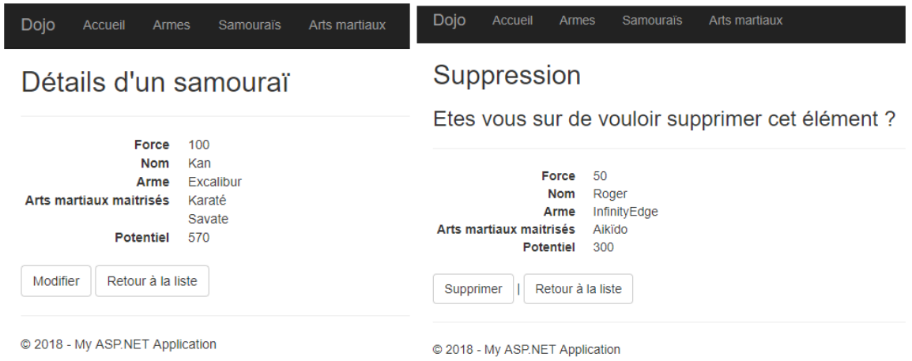
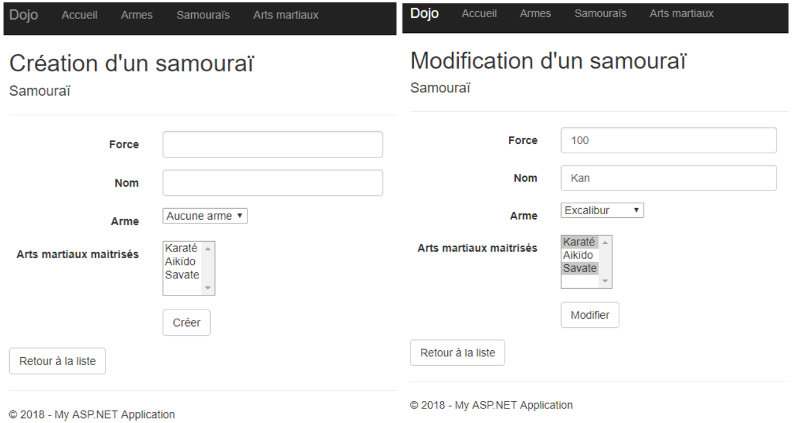
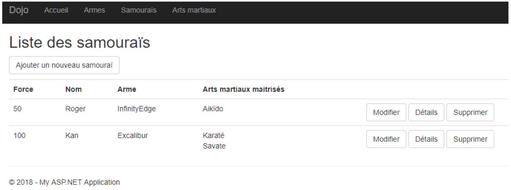

# TP - Dojo - Partie 2
*Module 6 TP 2 (tp7) - Entity Framework*

Durée : **3-5h**

### Objectifs
Le but de ce TP est de finaliser le site *Dojo* en utilisant toutes les connaissances accumulées lors de ce cours.

Pour ce TP, partir de la correction du TP précédent (*m6tp1-dojo-v1*).


### Enoncé

- [x] **\[m6tp2-A01\]** Ajouter une nouvelle classe dans votre BO, nommée `ArtMartial`
```csharp
public class ArtMartial
{
	public int Id { get; set; }
	public string Nom { get; set; }
}
```

- [x] **\[m6tp2-A02\]** Factoriser votre BO grâce à l'héritage, définir une classe abstraite portant l'id, propriété commune de toutes les classes de votre BO.

- [ ] **\[m6tp2-B01\]** Un samouraï possède désormais une liste d'arts martiaux.
- [ ] **\[m6tp2-B02\]** Désormais une `Arme` ne peut appartenir qu'à un seul samouraï.
- [ ] **\[m6tp2-B03\]** On ne peut plus supprimer une arme liée à un samouraï. Elle doit être détachée du samouraï au préalable sur la page de modification du dit samouraï
- [ ] **\[m6tp2-B04\]** Un art martial peut être associé à zéro ou plusieurs samouraïs

- [ ] **\[m6tp2-C01\]** Une fois le BO et Context modifié pour représenter ces changements, faire une nouvelle migration et mettre la base à jour. En cas de problème, ne pas hésiter à supprimer la bdd et la migration initiale afin de régénérer une unique migration portant tous les changements).
- [ ] **\[m6tp2-C02\]** Ajouter un contrôleur CRUD pour `ArtMartial`, avec toutes les vues nécessaires.
- [ ] **\[m6tp2-C03\]** Modifier les vues et le contrôleur pour `Samourai` afin de prendre en compte les nouvelles règles.
- [ ] **\[m6tp2-C04\]** La liste des armes proposées en ajout/modification d'un samouraï ne contient que les armes disponible, c-à-d non attachées à un samouraï.
- [ ] **\[m6tp2-C05\]** Qd on supprime un samouraï, son arme est détachée. Elle devient disponible pour les autres samouraïs.
- [ ] **\[m6tp2-C06\]** Afficher sur la page détails d'un samouraï son **potentiel** `(Force + dégats arme) * (nb d'arts martiaux + 1)`
- [ ] **\[m6tp2-C07\]** Ajouter des annotations aux classes du `BO` et au `ViewModel` pour obtenir les vues suivantes






### Pour aller plus loin

- [ ] **\[m6tp2-D01\]** Factoriser les vues `Edit` et `Create` du contrôleur `ArtMartial`, modifier les méthodes dudit contrôleur pour refléter les changements.
- [ ] **\[m6tp2-D02\]** Modifier toutes les vues du contrôleur `ArtMartial` pour afficher les libellés en français avec la ponctuation adéquate.
- [ ] **\[m6tp2-D03\]** Créer des méthodes d'extension sur la classe `HtmlHelper` pour factoriser le code de toutes les vues.


<style>

.img {
	border: 2px solid black;
	width: 80%;
}

.center {
  display: block;
  margin-left: auto;
  margin-right: auto;
}

</style>