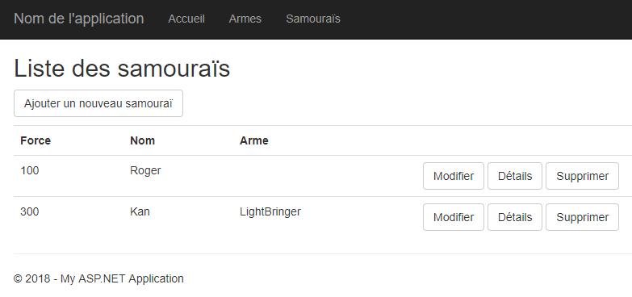
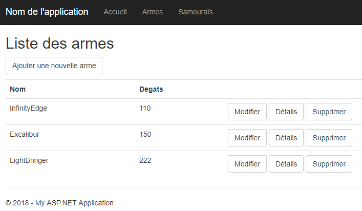

# TP - Dojo - Partie 1
Module 6 TP 1 (tp6) - Entity Framework

*Durée : **2-4h***

### Objectifs
Le but de ce TP est de réaliser un site web ASP.Net MVC utilisant l'ORM Entity Framework 6 pour la **persiostance des données**.

Ce site, appelé *Dojo*, recense les divers samouraïs d'un dojo ainsi que les armes qu'ils utilisent dans la pratique de leurs arts martiaux. 

Il faudra donc **créer** et **modifier** des samouraïs, **leur associer** une arme et les **enlever** du dojo.

### Enoncé

- [x] Créer un site web ASP.Net MVC sans authentification
- [x] Ajouter à la solution le projet `BO` fourni
- [x] Ajouter la référence du site web vers le BO
- [x] Générer la solution

Vous pouvez maintenant **créer les contrôleurs**, soit par vous-mêmes, soit en utilisant le wizard de Visual Studio.

- [x] Créer un contrôleur CRUD avec action lecture/écriture utilisant EF6 pour la classe `Samourai`
- [x] Créer un contrôleur CRUD avec action lecture/écriture utilisant EF6 pour la classe `Arme`
- [x] Passer le projet en migration manuelle
- [x] Ajouter votre première migration et mettre à jour la bdd

#### Partie Samouraï
- [x] Modifier les vues afin de pouvoir choisir une arme sur le samouraï en création et en modification
- [x] Modifier les vues pour afficher l'arme du samouraï sur l'affichage `list`, `details` et `delete`. Un Samouraï n'a pas obligatoirement une arme.
- [x] Modifier le code nécessaire dans `SamouraiController` pour prendre en compte l'ajout ou la modification de l'arme sur un samouraï.
- [x] Ajouter des liens dans le fichier `_layout` pour afficher la liste des armes et la liste des samouraïs.
- [x] Créer un jeu de données pour les armes en passant par le site
- [x] Modifier le code de suppression d'une arme pour gérer le cas d'une arme associée à un samouraï.
- [x] Créer et modifier des samouraïs en associant ou non des armes et vérifier que tout fonctionne correctement.

### Vues

**Liste des Samouraïs** :

**Liste des Armes** :

